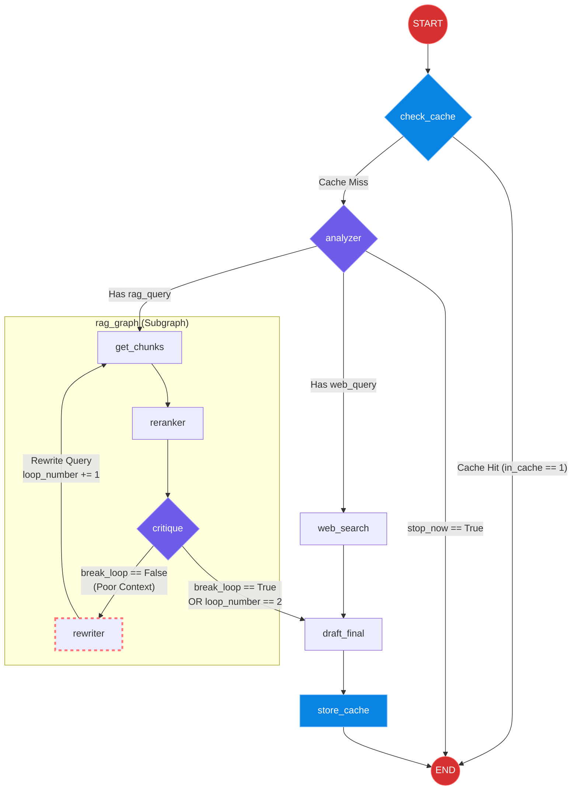

# Agentic RAG Pipeline with LangGraph

An advanced, fully asynchronous AI agent that intelligently routes queries, performs semantic caching, retrieves internal documents, and searches the web. Built using **LangGraph**, **FastAPI**, **Redis Stack**, and multiple AI models (OpenAI, Cohere).

## System Architecture & Workflow

The system utilizes an agentic workflow with parallel routing and a dedicated RAG feedback loop. 

Below is the execution graph representing the LangGraph state machine:



### The RAG Critique Loop Explained
Instead of blindly returning vector search results, the `rag_graph` subgraph enforces quality control:
1. **Retrieve & Rerank:** Fetches chunks from ChromaDB and passes them through the Cohere Reranker.
2. **Critique:** An LLM evaluates if the reranked context answers the query.
3. **Rewrite (The Loop):** If the context is poor, the `rewriter` node changes the search query based on the critique and loops the state back to `get_chunks`. It will break automatically after 2 loops to prevent infinite execution.

## Key Concepts & Learnings Applied

* **FastAPI Lifespan Events:** Managed application startup/shutdown gracefully. Used `@asynccontextmanager` to ensure the Redis index (`idx:cache`) initialized before accepting traffic.
* **Redis Semantic Cache:** Implemented a high-performance semantic cache using Redis Stack. Uses `SentenceTransformers` and Cosine Similarity to detect conceptually similar questions, bypassing LLM execution.
* **Tavily API:** Integrated an agentic search engine optimized for LLMs to fetch real-time web context.
* **Asynchronous Execution:** Migrated to a highly concurrent `async/await` architecture. Used `asyncio.to_thread` to offload CPU-bound embeddings to background threads, unblocking the FastAPI event loop.
* **Retry Policies:** Configured LangGraph `RetryPolicy` wrappers to handle transient network failures and HTTP 429 rate limits from external API providers.
* **LangGraph State Management:** Modeled complex agentic behaviors as directed graphs with custom nodes, `operator.add` reducers, and conditional edges to create parallel execution branches.

## Running the Application Locally

1. Clone the repository and navigate to the project directory.
2. Create a `.env` file in the root directory:
   ```env
   OPENAI_API_KEY=your_openai_key
   TAVILY_API_KEY=your_tavily_key
   COHERE_API_KEY=your_cohere_key
   REDIS_HOST=redis-stack
   ```
3. Run the system using Docker Compose:
   ```bash
   docker-compose up --build -d
   ```
4. The API will be live at `http://localhost:8000`.
