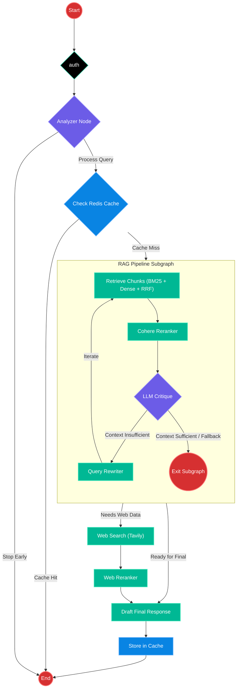

# Agentic RAG Pipeline with LangGraph

An advanced, fully asynchronous AI agent that intelligently routes queries, performs semantic caching, retrieves internal documents via hybrid search, and searches the web. Built using LangGraph, FastAPI, Redis Stack, and multiple AI models (OpenAI, Cohere).

## Performance & Evaluation (RAGAS)

The system is rigorously evaluated using the RAGAS framework to quantify retrieval quality and generation accuracy:

* **Retrieval Validation & Query Rewriting:** Integrating a reranker and an LLM evaluator into a dynamic critique loop increased overall pipeline correctness by 26% and retrieval precision by 15%.
* **Hybrid Search with RRF:** Extending standard dense retrieval with BM25 hybrid search and Reciprocal Rank Fusion (RRF) improved answer correctness by 11% and context recall by 14% over a reranker-only baseline.

## System Architecture & Workflow

The system utilizes an agentic workflow with parallel routing and a dedicated RAG feedback loop. Below is the execution graph representing the LangGraph state machine:


```mermaid
flowchart TD
    %% ===== Styling =====
    classDef process fill:#00b894,color:#ffffff,stroke:#55efc4,stroke-width:1.5px;
    classDef auth fill:#000000,color:#ffffff,stroke:#55efc4,stroke-width:1.5px;
    classDef decision fill:#6c5ce7,color:#ffffff,stroke:#a29bfe,stroke-width:1.5px;
    classDef cache fill:#0984e3,color:#ffffff,stroke:#74b9ff,stroke-width:1.5px;
    classDef endpoint fill:#d63031,color:#ffffff,stroke:#ff7675,stroke-width:2px;

    %% ===== Main Flow =====
    Start((Start)):::endpoint
    End((End)):::endpoint

    Auth{"auth"}:::auth
    Analyzer{"Analyzer Node"}:::decision
    CheckCache{"Check Redis Cache"}:::cache
    StoreCache["Store in Cache"]:::cache

    WebSearch["Web Search (Tavily)"]:::process
    WebRerank["Web Reranker"]:::process
    Final["Draft Final Response"]:::process

    %% ===== Main Routing =====
    Start ---> Auth
    Auth --> Analyzer
    Analyzer -- "Stop Early" --> End
    Analyzer -- "Process Query" --> CheckCache

    CheckCache -- "Cache Hit" --> End
    CheckCache -- "Cache Miss" --> RAG_Pipeline

    %% ===== RAG Subgraph =====
    subgraph RAG_Pipeline ["RAG Pipeline Subgraph"]
        direction TB

        GetChunks["Retrieve Chunks (BM25 + Dense + RRF)"]:::process
        Reranker["Cohere Reranker"]:::process
        Critique{"LLM Critique"}:::decision
        Rewriter["Query Rewriter"]:::process

        GetChunks --> Reranker --> Critique
        
        Critique -- "Context Insufficient" --> Rewriter
        Rewriter -->|"Iterate"| GetChunks
        
        Critique -- "Context Sufficient / Fallback" --> SubgraphExit((Exit Subgraph)):::endpoint
    end

    %% ===== Post-RAG Routing =====
    RAG_Pipeline -- "Needs Web Data" --> WebSearch
    RAG_Pipeline -- "Ready for Final" --> Final

    %% ===== Web & Finalization =====
    WebSearch --> WebRerank --> Final
    Final --> StoreCache --> End
```

## Advanced Pipeline Features Explained

* **Hybrid Search & RRF:** The `get_chunks` node utilizes a dual-retrieval strategy. It combines dense vector embeddings with BM25 lexical search, merging the results using Reciprocal Rank Fusion (RRF) to capture both semantic meaning and exact keyword matches.
* **RAG Critique Loop:**
  * **Retrieve & Rerank:** Fetches chunks from the vector database and scores them.
  * **Critique:** An LLM evaluates if the context actually answers the user's intent.
  * **Rewrite (The Loop):** If the context is poor, the rewriter node adjusts the search query based on the critique and loops the state back to `get_chunks`.
* **The Dynamic Web Fallback:** The system operates defensively. If the RAG subgraph exhausts its loops or determines the retrieved internal context is irrelevant, a fallback condition triggers, routing the execution to the `web_search` node to prevent hallucinations.
* **Dual-Reranking Architecture:** Reranking is applied to both internal and external data. The `web_reranker` node acts as a noise filter for Tavily Search results, applying Cohere's scoring model to raw web scrapes to extract only the highest-density information before final drafting.

## Key Concepts & Learnings Applied

* **FastAPI Lifespan Events:** Managed application startup/shutdown gracefully. Used `@asynccontextmanager` to ensure the Redis index (`idx:cache`) initialized before accepting traffic.
* **Redis Semantic Cache:** Implemented a high-performance semantic cache using Redis Stack. Uses `SentenceTransformers` and Cosine Similarity to detect conceptually similar questions, bypassing LLM execution entirely for recurring queries.
* **Tavily API:** Integrated an agentic search engine optimized for LLMs to fetch real-time web context.
* **Asynchronous Execution:** Engineered a highly concurrent async/await architecture. Used `asyncio.to_thread` to offload CPU-bound embeddings to background threads, unblocking the FastAPI event loop.
* **Retry Policies:** Configured LangGraph RetryPolicy wrappers to handle transient network failures and HTTP 429 rate limits from external API providers smoothly.
* **LangGraph State Management:** Modeled complex agentic behaviors as directed graphs and subgraphs with custom nodes and conditional edges to create isolated execution branches.

## Running the Application Locally

1. Clone the repository and navigate to the project directory.
2. Create a `.env` file in the root directory:

```env
OPENAI_API_KEY=your_openai_key
TAVILY_API_KEY=your_tavily_key
COHERE_API_KEY=your_cohere_key
REDIS_HOST=redis-stack
```

3. Run the system using Docker Compose:

```bash
docker-compose up --build -d
```

4. The API will be live at `http://localhost:8000`.